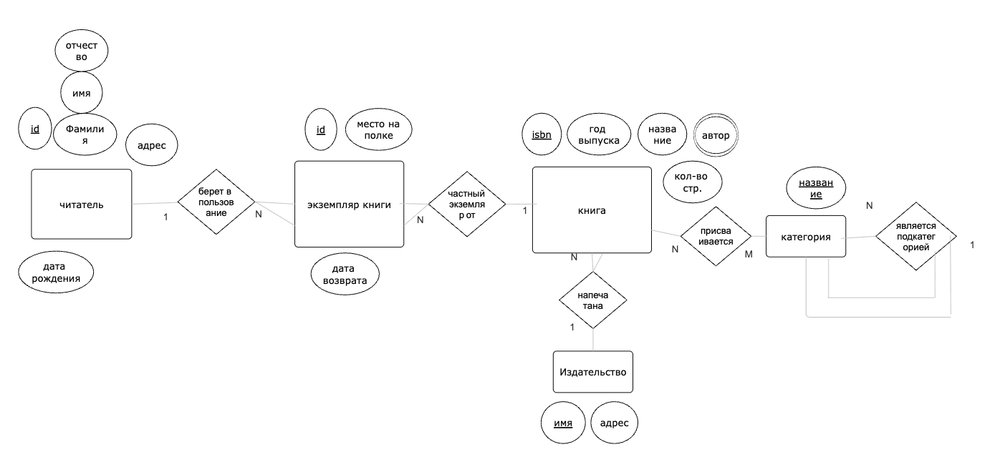

# ДЗ

***Упражнение 1. Нарисуйте E/R диаграмму для библиотечной системы, основываясь на следующих требованиях:
Библиотека хранит экземпляры книг. Каждый экземпляр имеет уникальный номер экземпляра, положение на полке и может быть однозначно идентифицирован по номеру экземпляра вместе с ISBN. Каждая книга имеет уникальный номер ISBN, год выпуска, название, автора и количество страниц. Книги публикуются издательствами.
У издателя есть имя и адрес. В библиотечной системе книгам присваивается одна или несколько категорий. Категории образуют иерархию, поэтому категория может быть просто подчиненной другой категории. Категория имеет название и не имеет других свойств. 
Каждому читателю присваивается уникальный читательский номер. У читателя есть фамилия, имя-отчество, адрес и дата рождения. Читатель может взять один или несколько экземпляров Книги. При заимствовании указывается планируемая дата возврата.***

---

