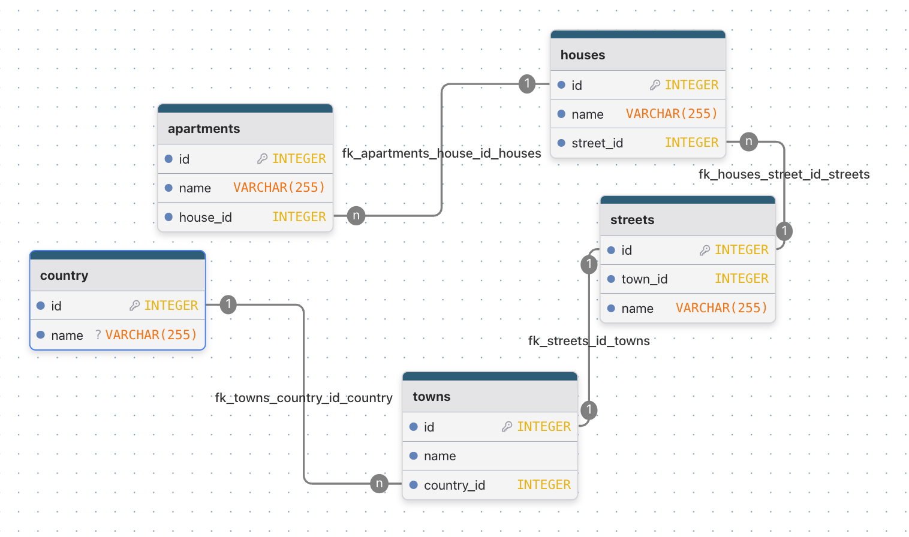
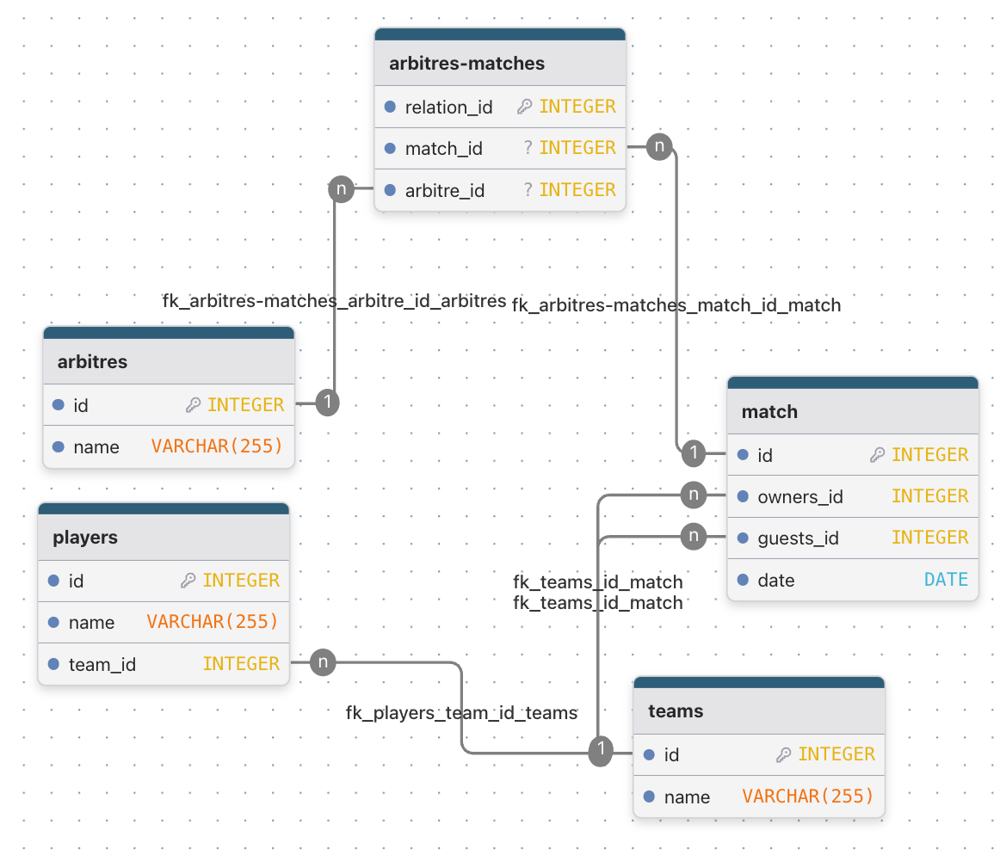

# ДЗ 3

## 1. Почему у каждого отношения в реляционной БД должен быть хотя бы один ключ?

Потому что без ключа невозможно однозначно идентифицировать, выбрать или обновить конкретную строку (кортеж) в отношении (таблице). Это приводит к потере целостности данных и делает данные бессмысленными.

## 2. Переведите все E/R диаграммы из прошлого задания в реляционные базы данных (по правилам с лекции).

библиотека

квартиры

матч

## 3. Переведите E/R диаграммы в реляционные базы данных.