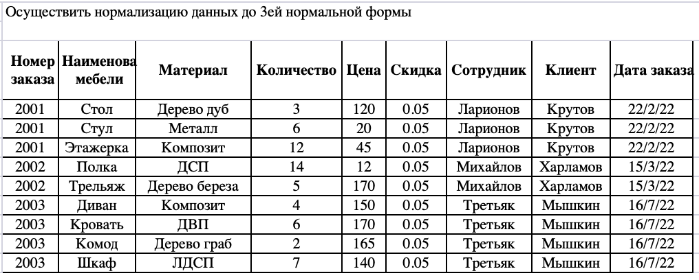
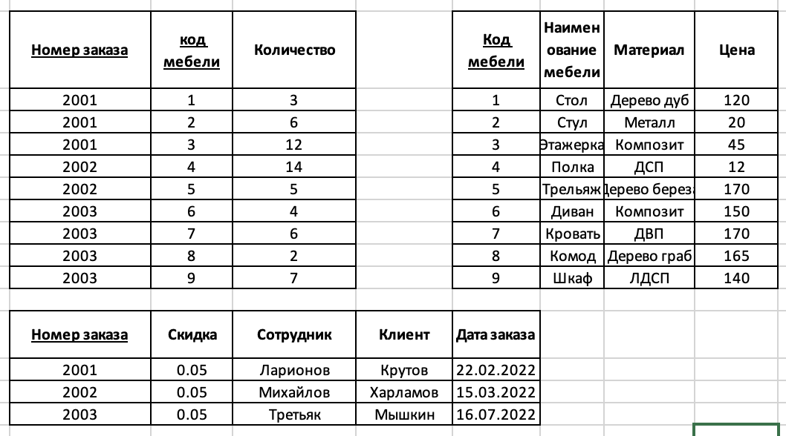

# ДЗ 3

БАБУШКИН ВЛАДИМИР БПИ237 семинар 04.10.2025

ДЗ: нормализовать до 3ей нормальной формы. так как тут нет первичного ключа, то его нужно придумать самостоятельно, за тем декомпозировать до 2ой формы и за тем до 3ей

## 3я нормальная форма

