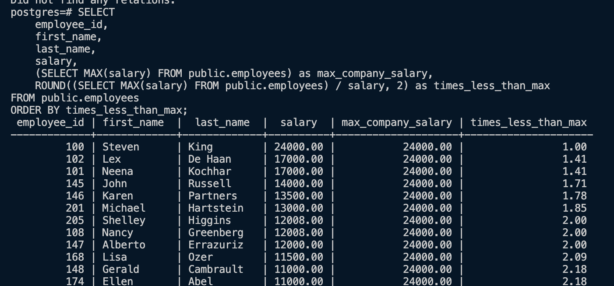
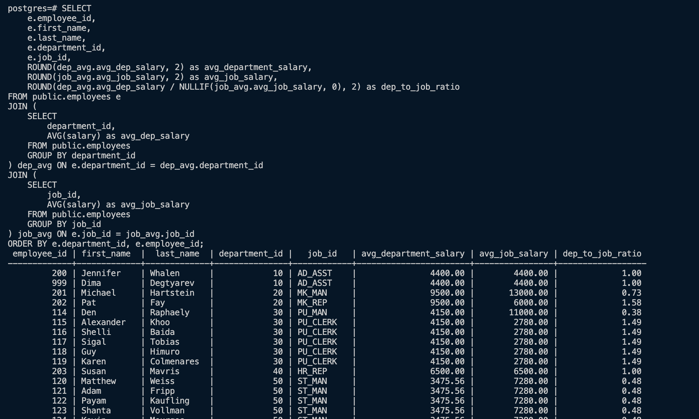
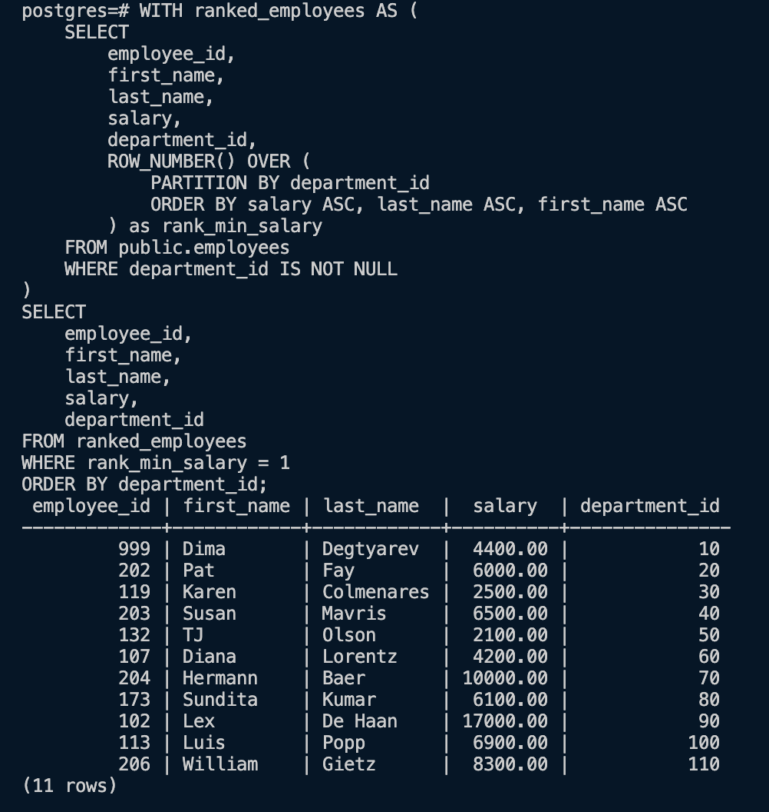
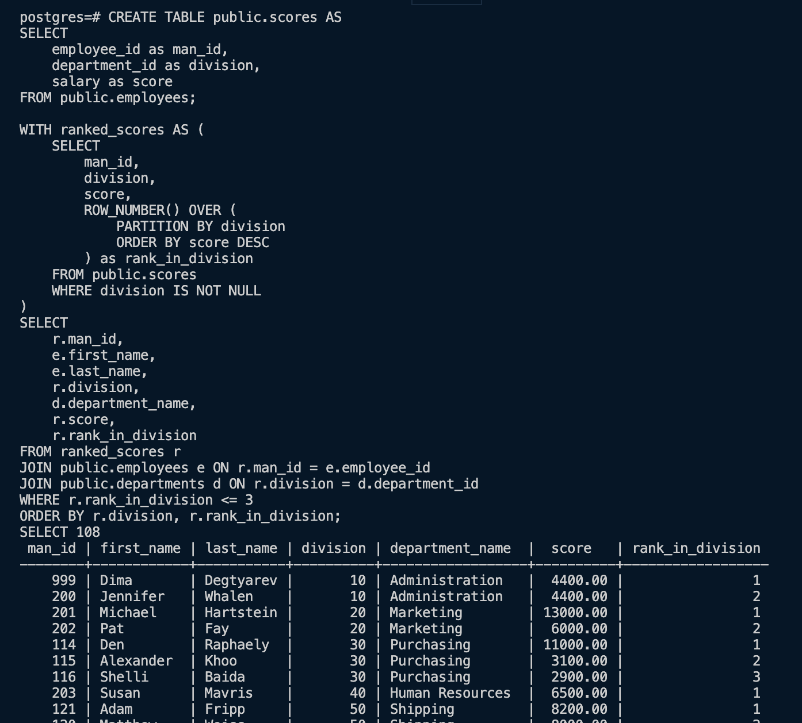
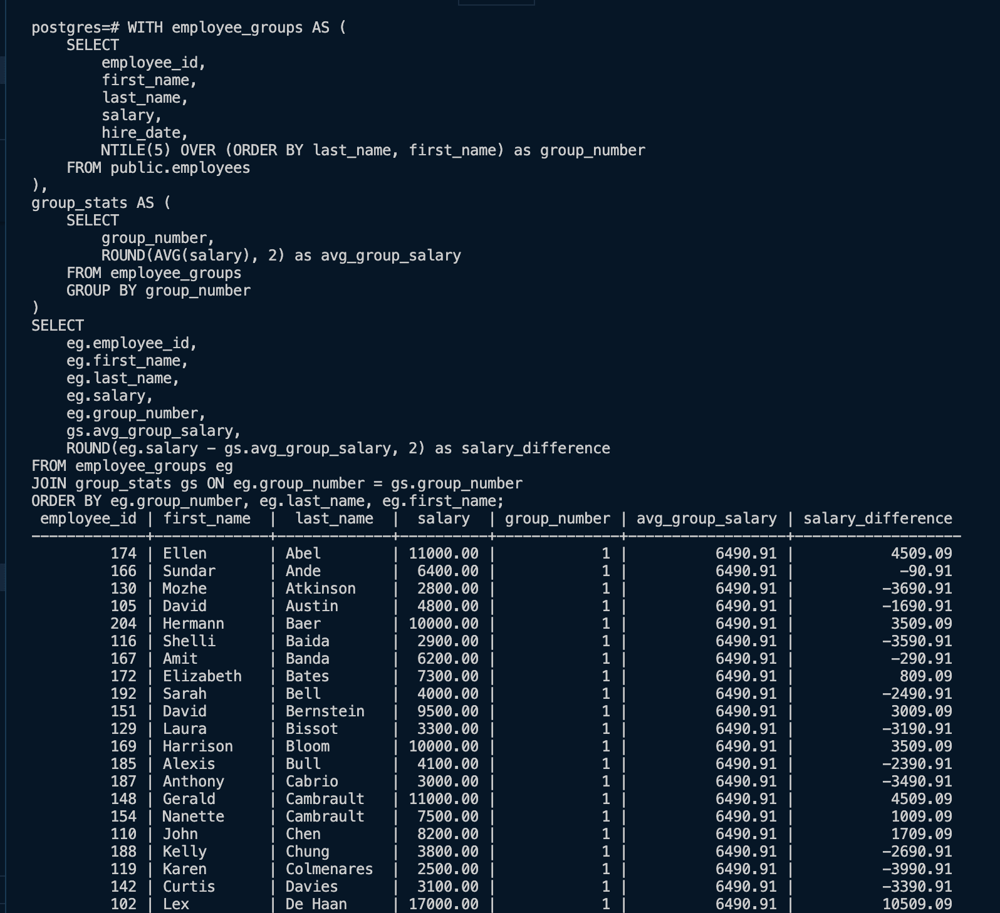
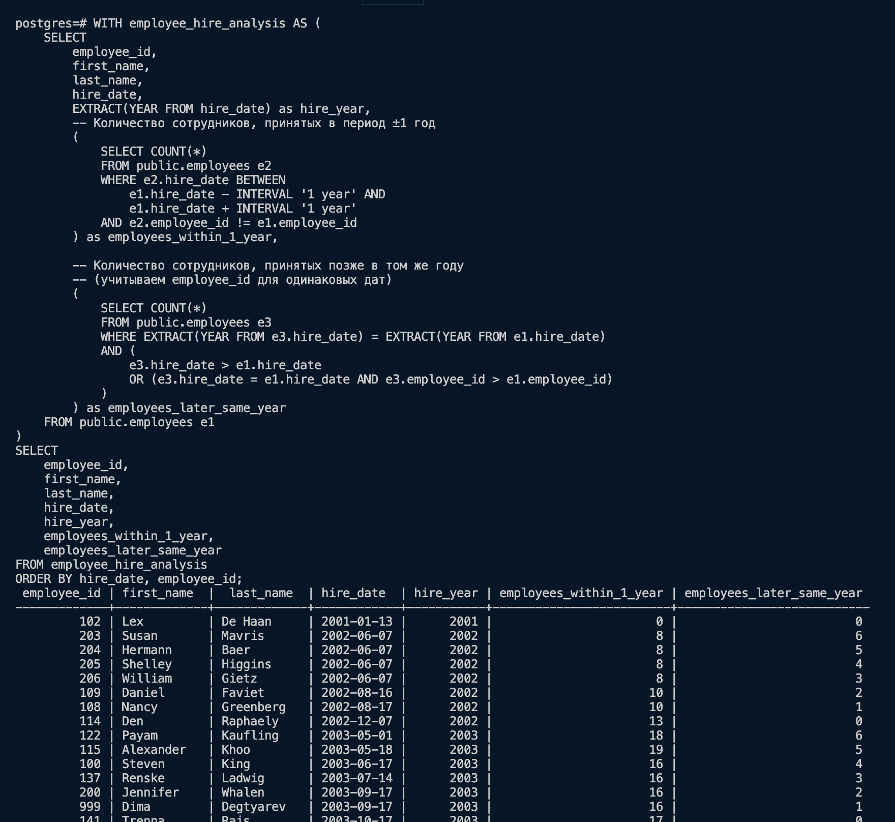

# ДЗ 7

```
SELECT 
    employee_id,
    first_name,
    last_name,
    salary,
    (SELECT MAX(salary) FROM public.employees) as max_company_salary,
    ROUND((SELECT MAX(salary) FROM public.employees) / salary, 2) as times_less_than_max
FROM public.employees
ORDER BY times_less_than_max;
```



## 2

```sql
SELECT 
    employee_id,
    first_name,
    last_name,
    salary,
    department_id,
    ROUND(AVG(salary) OVER (PARTITION BY department_id), 2) as avg_department_salary,
    ROUND(salary / AVG(salary) OVER (PARTITION BY department_id), 2) as times_difference
FROM public.employees
ORDER BY department_id, times_difference DESC;
```


## 3

```sql
SELECT 
    e.employee_id,
    e.first_name,
    e.last_name,
    e.department_id,
    e.job_id,
    ROUND(dep_avg.avg_dep_salary, 2) as avg_department_salary,
    ROUND(job_avg.avg_job_salary, 2) as avg_job_salary,
    ROUND(dep_avg.avg_dep_salary / NULLIF(job_avg.avg_job_salary, 0), 2) as dep_to_job_ratio
FROM public.employees e
JOIN (
    SELECT 
        department_id,
        AVG(salary) as avg_dep_salary
    FROM public.employees
    GROUP BY department_id
) dep_avg ON e.department_id = dep_avg.department_id
JOIN (
    SELECT 
        job_id,
        AVG(salary) as avg_job_salary
    FROM public.employees
    GROUP BY job_id
) job_avg ON e.job_id = job_avg.job_id
ORDER BY e.department_id, e.employee_id;
```



## 4

```sql
WITH ranked_employees AS (
    SELECT 
        employee_id,
        first_name,
        last_name,
        salary,
        department_id,
        ROW_NUMBER() OVER (
            PARTITION BY department_id 
            ORDER BY salary ASC, last_name ASC, first_name ASC
        ) as rank_min_salary
    FROM public.employees
    WHERE department_id IS NOT NULL
)
SELECT 
    employee_id,
    first_name,
    last_name,
    salary,
    department_id
FROM ranked_employees
WHERE rank_min_salary = 1
ORDER BY department_id;
```



## 5

```sql
CREATE TABLE public.scores AS
SELECT 
    employee_id as man_id,
    department_id as division,
    salary as score
FROM public.employees;

WITH ranked_scores AS (
    SELECT 
        man_id,
        division,
        score,
        ROW_NUMBER() OVER (
            PARTITION BY division 
            ORDER BY score DESC
        ) as rank_in_division
    FROM public.scores
    WHERE division IS NOT NULL
)
SELECT 
    r.man_id,
    e.first_name,
    e.last_name,
    r.division,
    d.department_name,
    r.score,
    r.rank_in_division
FROM ranked_scores r
JOIN public.employees e ON r.man_id = e.employee_id
JOIN public.departments d ON r.division = d.department_id
WHERE r.rank_in_division <= 3
ORDER BY r.division, r.rank_in_division;
```



## 6

```sql
WITH employee_groups AS (
    SELECT 
        employee_id,
        first_name,
        last_name,
        salary,
        hire_date,
        NTILE(5) OVER (ORDER BY last_name, first_name) as group_number
    FROM public.employees
),
group_stats AS (
    SELECT 
        group_number,
        ROUND(AVG(salary), 2) as avg_group_salary
    FROM employee_groups
    GROUP BY group_number
)
SELECT 
    eg.employee_id,
    eg.first_name,
    eg.last_name,
    eg.salary,
    eg.group_number,
    gs.avg_group_salary,
    ROUND(eg.salary - gs.avg_group_salary, 2) as salary_difference
FROM employee_groups eg
JOIN group_stats gs ON eg.group_number = gs.group_number
ORDER BY eg.group_number, eg.last_name, eg.first_name;
```



## 7

```sql
WITH employee_hire_analysis AS (
    SELECT 
        employee_id,
        first_name,
        last_name,
        hire_date,
        EXTRACT(YEAR FROM hire_date) as hire_year,
        -- Количество сотрудников, принятых в период ±1 год
        (
            SELECT COUNT(*) 
            FROM public.employees e2 
            WHERE e2.hire_date BETWEEN 
                e1.hire_date - INTERVAL '1 year' AND 
                e1.hire_date + INTERVAL '1 year'
            AND e2.employee_id != e1.employee_id
        ) as employees_within_1_year,
        
        -- Количество сотрудников, принятых позже в том же году
        -- (учитываем employee_id для одинаковых дат)
        (
            SELECT COUNT(*)
            FROM public.employees e3
            WHERE EXTRACT(YEAR FROM e3.hire_date) = EXTRACT(YEAR FROM e1.hire_date)
            AND (
                e3.hire_date > e1.hire_date 
                OR (e3.hire_date = e1.hire_date AND e3.employee_id > e1.employee_id)
            )
        ) as employees_later_same_year
    FROM public.employees e1
)
SELECT 
    employee_id,
    first_name,
    last_name,
    hire_date,
    hire_year,
    employees_within_1_year,
    employees_later_same_year
FROM employee_hire_analysis
ORDER BY hire_date, employee_id;
```

