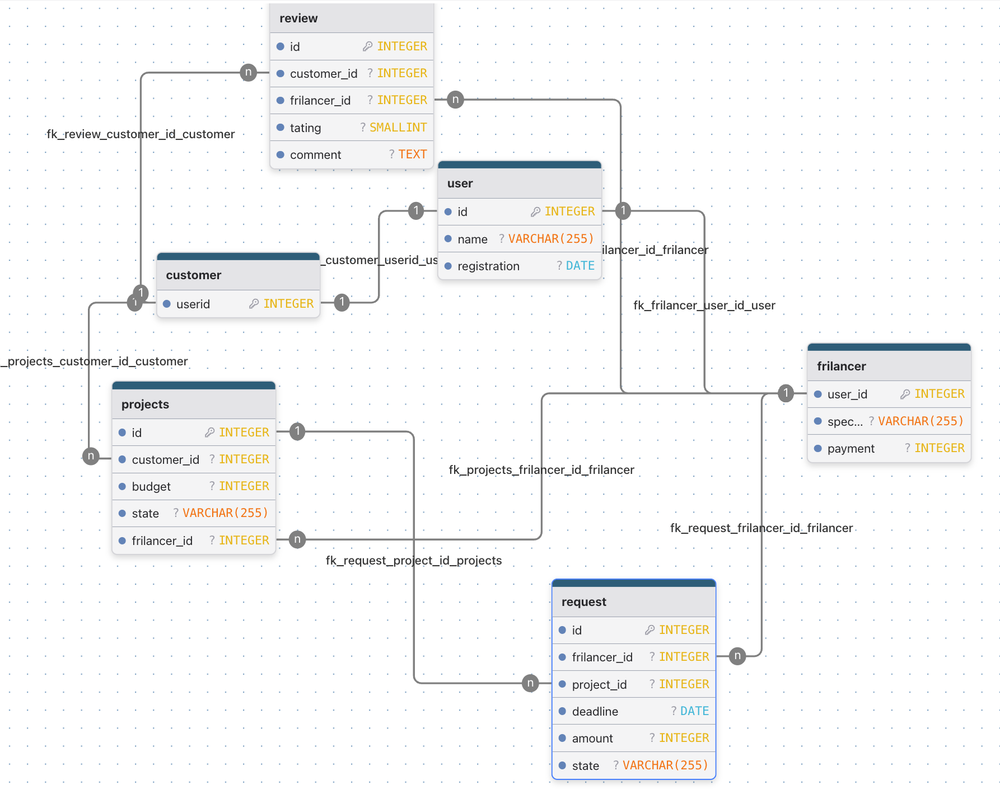

## 2.


## 3.
```sql
SELECT 
    u.name AS freelancer_name,
    COUNT(r.id) AS applications_count
FROM 
    frilancer f
JOIN 
    user u ON f.user_id = u.id
JOIN 
    request r ON f.user_id = r.frilancer_id
WHERE 
    f.specializaton = 'Python'
    AND EXTRACT(YEAR FROM r.deadline) = 2023
    AND r.status = 'finished'
GROUP BY 
    u.name, f.user_id
HAVING 
    COUNT(r.id) > 3
ORDER BY 
    applications_count DESC;
```

## 4

```sql
select 
    p.id
from
    requests r
join
    frilancers f on r.friloancer_id = f.user_id
where
    p.budget > 50000 and f.payment >1500

```

## 5

